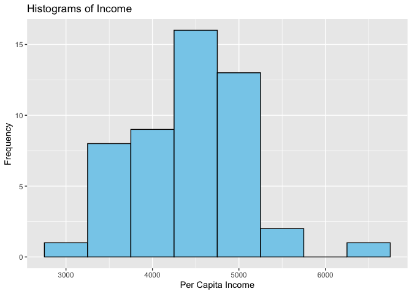
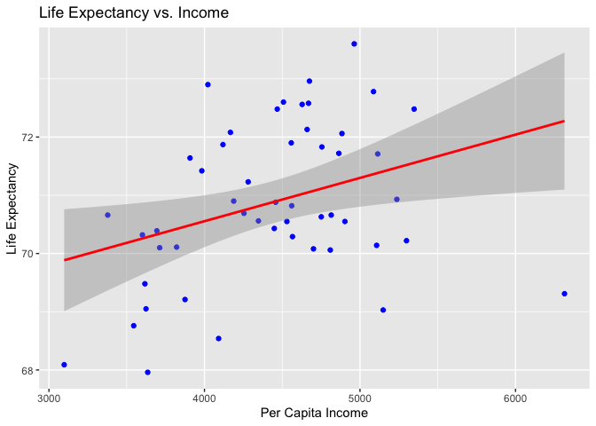
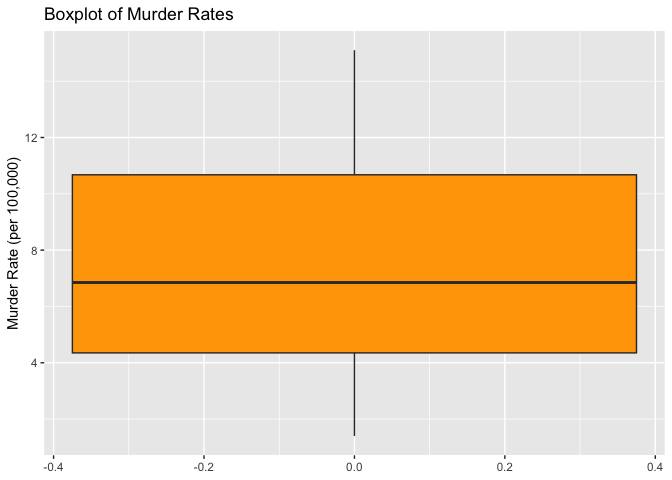
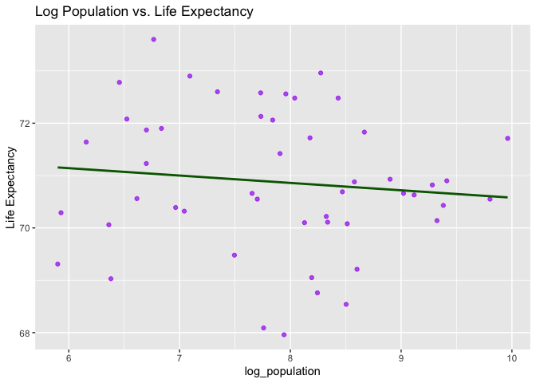
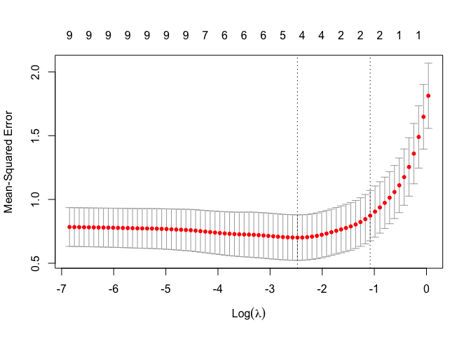
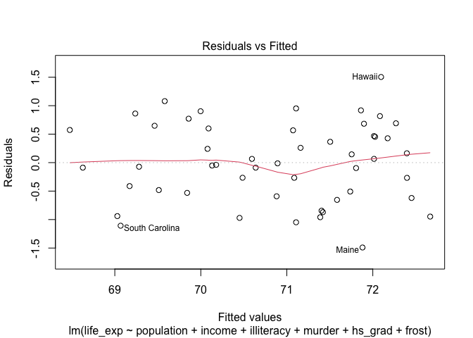
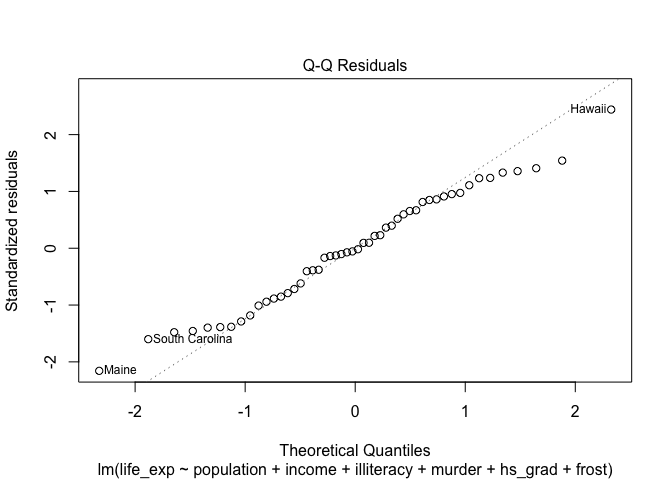
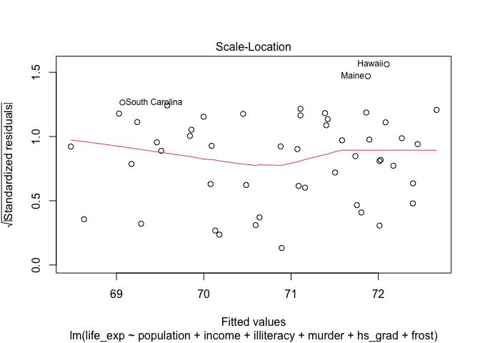
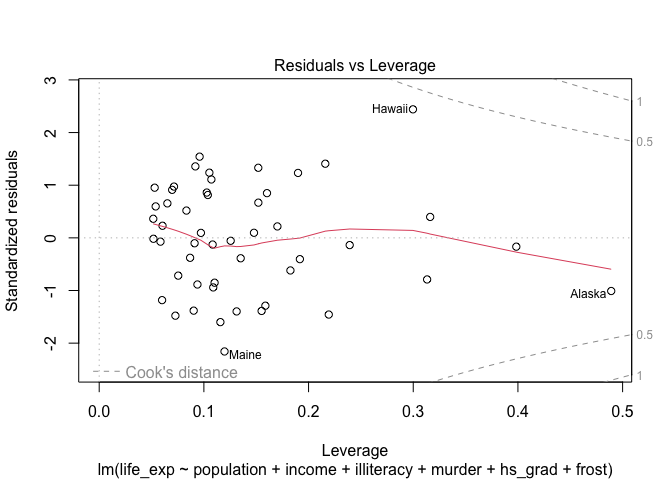

Homework 5
================

``` r
library(tidyverse)
```

    ## ── Attaching core tidyverse packages ──────────────────────── tidyverse 2.0.0 ──
    ## ✔ dplyr     1.1.4     ✔ readr     2.1.5
    ## ✔ forcats   1.0.0     ✔ stringr   1.5.1
    ## ✔ ggplot2   3.5.1     ✔ tibble    3.2.1
    ## ✔ lubridate 1.9.3     ✔ tidyr     1.3.1
    ## ✔ purrr     1.0.2     
    ## ── Conflicts ────────────────────────────────────────── tidyverse_conflicts() ──
    ## ✖ dplyr::filter() masks stats::filter()
    ## ✖ dplyr::lag()    masks stats::lag()
    ## ℹ Use the conflicted package (<http://conflicted.r-lib.org/>) to force all conflicts to become errors

``` r
library(faraway)
library(MASS)
```

    ## 
    ## Attaching package: 'MASS'
    ## 
    ## The following object is masked from 'package:dplyr':
    ## 
    ##     select

``` r
library(leaps)
library(glmnet)
```

    ## Loading required package: Matrix
    ## 
    ## Attaching package: 'Matrix'
    ## 
    ## The following objects are masked from 'package:tidyr':
    ## 
    ##     expand, pack, unpack
    ## 
    ## Loaded glmnet 4.1-8

``` r
library(caret)
```

    ## Loading required package: lattice
    ## 
    ## Attaching package: 'lattice'
    ## 
    ## The following object is masked from 'package:faraway':
    ## 
    ##     melanoma
    ## 
    ## 
    ## Attaching package: 'caret'
    ## 
    ## The following object is masked from 'package:purrr':
    ## 
    ##     lift

``` r
# import and clean data
states = as.data.frame(datasets::state.x77) |> 
  janitor::clean_names() 

# create a column for state names
states$state = rownames(states)

head(states)
```

    ##            population income illiteracy life_exp murder hs_grad frost   area
    ## Alabama          3615   3624        2.1    69.05   15.1    41.3    20  50708
    ## Alaska            365   6315        1.5    69.31   11.3    66.7   152 566432
    ## Arizona          2212   4530        1.8    70.55    7.8    58.1    15 113417
    ## Arkansas         2110   3378        1.9    70.66   10.1    39.9    65  51945
    ## California      21198   5114        1.1    71.71   10.3    62.6    20 156361
    ## Colorado         2541   4884        0.7    72.06    6.8    63.9   166 103766
    ##                 state
    ## Alabama       Alabama
    ## Alaska         Alaska
    ## Arizona       Arizona
    ## Arkansas     Arkansas
    ## California California
    ## Colorado     Colorado

``` r
sum(is.na(states))
```

    ## [1] 0

- population: population estimate  
- income: per capita income  
- illiteracy: illiteracy (%)  
- life_exp: life expectancy (years)  
- murder: murder and non-negligent manslaughter rate per 100,000
  population  
- hs_grad: high-school graduates (%)  
- frost: mean number of days with minimum temperature below freezing in
  capital or large city  
- area: land area (sq. miles)

# Problem 1

R dataset state.x77 from library(faraway) contains information on 50
states from 1970s collected by US Census Bureau. The goal is to predict
‘life expectancy’ using a combination of remaining variables.

## part a

Provide descriptive statistics for all variables of interest (continuous
and categorical).

``` r
summary(states)
```

    ##    population        income       illiteracy       life_exp    
    ##  Min.   :  365   Min.   :3098   Min.   :0.500   Min.   :67.96  
    ##  1st Qu.: 1080   1st Qu.:3993   1st Qu.:0.625   1st Qu.:70.12  
    ##  Median : 2838   Median :4519   Median :0.950   Median :70.67  
    ##  Mean   : 4246   Mean   :4436   Mean   :1.170   Mean   :70.88  
    ##  3rd Qu.: 4968   3rd Qu.:4814   3rd Qu.:1.575   3rd Qu.:71.89  
    ##  Max.   :21198   Max.   :6315   Max.   :2.800   Max.   :73.60  
    ##      murder          hs_grad          frost             area       
    ##  Min.   : 1.400   Min.   :37.80   Min.   :  0.00   Min.   :  1049  
    ##  1st Qu.: 4.350   1st Qu.:48.05   1st Qu.: 66.25   1st Qu.: 36985  
    ##  Median : 6.850   Median :53.25   Median :114.50   Median : 54277  
    ##  Mean   : 7.378   Mean   :53.11   Mean   :104.46   Mean   : 70736  
    ##  3rd Qu.:10.675   3rd Qu.:59.15   3rd Qu.:139.75   3rd Qu.: 81162  
    ##  Max.   :15.100   Max.   :67.30   Max.   :188.00   Max.   :566432  
    ##     state          
    ##  Length:50         
    ##  Class :character  
    ##  Mode  :character  
    ##                    
    ##                    
    ## 

- standard deviation  
- variance

## part b

Examine exploratory plots, e.g., scatter plots, histograms, box-plots to
get a sense of the data and possible variable transformations. (Be
selective! Even if you create 20 plots, you don’t want to show them
all). If you find a transformation to be necessary or recommended,
perform the transformation and use it through the rest of the problem.

``` r
ggplot(states, aes(x = income)) +
  geom_histogram(binwidth = 500, fill = "skyblue", color = "black") +
  labs(
    title = "Histograms of Income", 
    x = "Per Capita Income", 
    y = "Frequency")
```

<!-- -->

``` r
ggplot(states, aes(x = income, y = life_exp)) +
  geom_point(color = "blue") +
  geom_smooth(method = "lm", color = "red") +
  labs(
    title = "Life Expectancy vs. Income", 
    x = "Per Capita Income",
    y = "Life Expectancy")
```

    ## `geom_smooth()` using formula = 'y ~ x'

<!-- -->

``` r
ggplot(states, aes(y = murder)) +
  geom_boxplot(fill = "orange") +
  labs(
    title = "Boxplot of Murder Rates", 
    y = "Murder Rate (per 100,000)")
```

<!-- -->

``` r
states = states |> 
  mutate(
   log_population = ifelse(population > 0, log(population), NA),
   log_area = ifelse(area > 0, log(area), NA))

ggplot(states, aes(x = log_population, y = life_exp)) +
  geom_point(color = "purple", alpha = 0.7) +
  geom_smooth(method = "lm", color = "darkgreen", se = FALSE) +
  labs(
    title = "Log Population vs. Life Expectancy", 
    y = "Life Expectancy"
  )
```

    ## `geom_smooth()` using formula = 'y ~ x'

<!-- -->

## part c

Use automatic procedures to find a ‘best subset’ of the full model.
Present the results and comment on the following:

- Do the procedures generate the same model?  
- Are any variables a close call? What was you decision: keep or
  discard? Provide arguments for your choice. (Note: this question might
  have more or less relevance depending on the ‘subset’ you choose).  
- Is there any association between ‘Illiteracy’ and ‘HS graduation
  rate’? Does your ‘subset’ contain both?

``` r
full_model = lm(life_exp ~ ., data = states)

# backward stepwise selection
partial_model = lm(life_exp ~ population + income + illiteracy + murder + hs_grad + frost, data = states)
summary(partial_model)
```

    ## 
    ## Call:
    ## lm(formula = life_exp ~ population + income + illiteracy + murder + 
    ##     hs_grad + frost, data = states)
    ## 
    ## Residuals:
    ##      Min       1Q   Median       3Q      Max 
    ## -1.49047 -0.52533 -0.02546  0.57160  1.50374 
    ## 
    ## Coefficients:
    ##               Estimate Std. Error t value Pr(>|t|)    
    ## (Intercept)  7.099e+01  1.387e+00  51.165  < 2e-16 ***
    ## population   5.188e-05  2.879e-05   1.802   0.0785 .  
    ## income      -2.444e-05  2.343e-04  -0.104   0.9174    
    ## illiteracy   2.846e-02  3.416e-01   0.083   0.9340    
    ## murder      -3.018e-01  4.334e-02  -6.963 1.45e-08 ***
    ## hs_grad      4.847e-02  2.067e-02   2.345   0.0237 *  
    ## frost       -5.776e-03  2.970e-03  -1.945   0.0584 .  
    ## ---
    ## Signif. codes:  0 '***' 0.001 '**' 0.01 '*' 0.05 '.' 0.1 ' ' 1
    ## 
    ## Residual standard error: 0.7361 on 43 degrees of freedom
    ## Multiple R-squared:  0.7361, Adjusted R-squared:  0.6993 
    ## F-statistic: 19.99 on 6 and 43 DF,  p-value: 5.362e-11

``` r
backward_model = step(partial_model, direction = "backward")
```

    ## Start:  AIC=-24.18
    ## life_exp ~ population + income + illiteracy + murder + hs_grad + 
    ##     frost
    ## 
    ##              Df Sum of Sq    RSS     AIC
    ## - illiteracy  1    0.0038 23.302 -26.174
    ## - income      1    0.0059 23.304 -26.170
    ## <none>                    23.298 -24.182
    ## - population  1    1.7599 25.058 -22.541
    ## - frost       1    2.0488 25.347 -21.968
    ## - hs_grad     1    2.9804 26.279 -20.163
    ## - murder      1   26.2721 49.570  11.569
    ## 
    ## Step:  AIC=-26.17
    ## life_exp ~ population + income + murder + hs_grad + frost
    ## 
    ##              Df Sum of Sq    RSS     AIC
    ## - income      1     0.006 23.308 -28.161
    ## <none>                    23.302 -26.174
    ## - population  1     1.887 25.189 -24.280
    ## - frost       1     3.037 26.339 -22.048
    ## - hs_grad     1     3.495 26.797 -21.187
    ## - murder      1    34.739 58.041  17.456
    ## 
    ## Step:  AIC=-28.16
    ## life_exp ~ population + murder + hs_grad + frost
    ## 
    ##              Df Sum of Sq    RSS     AIC
    ## <none>                    23.308 -28.161
    ## - population  1     2.064 25.372 -25.920
    ## - frost       1     3.122 26.430 -23.877
    ## - hs_grad     1     5.112 28.420 -20.246
    ## - murder      1    34.816 58.124  15.528

``` r
summary(backward_model)
```

    ## 
    ## Call:
    ## lm(formula = life_exp ~ population + murder + hs_grad + frost, 
    ##     data = states)
    ## 
    ## Residuals:
    ##      Min       1Q   Median       3Q      Max 
    ## -1.47095 -0.53464 -0.03701  0.57621  1.50683 
    ## 
    ## Coefficients:
    ##               Estimate Std. Error t value Pr(>|t|)    
    ## (Intercept)  7.103e+01  9.529e-01  74.542  < 2e-16 ***
    ## population   5.014e-05  2.512e-05   1.996  0.05201 .  
    ## murder      -3.001e-01  3.661e-02  -8.199 1.77e-10 ***
    ## hs_grad      4.658e-02  1.483e-02   3.142  0.00297 ** 
    ## frost       -5.943e-03  2.421e-03  -2.455  0.01802 *  
    ## ---
    ## Signif. codes:  0 '***' 0.001 '**' 0.01 '*' 0.05 '.' 0.1 ' ' 1
    ## 
    ## Residual standard error: 0.7197 on 45 degrees of freedom
    ## Multiple R-squared:  0.736,  Adjusted R-squared:  0.7126 
    ## F-statistic: 31.37 on 4 and 45 DF,  p-value: 1.696e-12

``` r
null_model = lm(life_exp ~ 1, data = states)

# forward stepwise selection
forward_model = step(null_model, scope = list(lower = null_model, upper = full_model), direction = "forward")
```

    ## Start:  AIC=30.44
    ## life_exp ~ 1
    ## 
    ##                  Df Sum of Sq    RSS  AIC
    ## + state          49    88.299  0.000 -Inf
    ## + murder          1    53.838 34.461  -15
    ## + illiteracy      1    30.578 57.721   11
    ## + hs_grad         1    29.931 58.368   12
    ## + income          1    10.223 78.076   26
    ## + frost           1     6.064 82.235   29
    ## <none>                        88.299   30
    ## + log_population  1     1.054 87.245   32
    ## + log_area        1     1.042 87.257   32
    ## + area            1     1.017 87.282   32
    ## + population      1     0.409 87.890   32
    ## 
    ## Step:  AIC=-Inf
    ## life_exp ~ state

    ## Warning: attempting model selection on an essentially perfect fit is nonsense

    ##        Df Sum of Sq RSS  AIC
    ## <none>                0 -Inf

``` r
summary(forward_model)
```

    ## 
    ## Call:
    ## lm(formula = life_exp ~ state, data = states)
    ## 
    ## Residuals:
    ## ALL 50 residuals are 0: no residual degrees of freedom!
    ## 
    ## Coefficients:
    ##                     Estimate Std. Error t value Pr(>|t|)
    ## (Intercept)            69.05        NaN     NaN      NaN
    ## stateAlaska             0.26        NaN     NaN      NaN
    ## stateArizona            1.50        NaN     NaN      NaN
    ## stateArkansas           1.61        NaN     NaN      NaN
    ## stateCalifornia         2.66        NaN     NaN      NaN
    ## stateColorado           3.01        NaN     NaN      NaN
    ## stateConnecticut        3.43        NaN     NaN      NaN
    ## stateDelaware           1.01        NaN     NaN      NaN
    ## stateFlorida            1.61        NaN     NaN      NaN
    ## stateGeorgia           -0.51        NaN     NaN      NaN
    ## stateHawaii             4.55        NaN     NaN      NaN
    ## stateIdaho              2.82        NaN     NaN      NaN
    ## stateIllinois           1.09        NaN     NaN      NaN
    ## stateIndiana            1.83        NaN     NaN      NaN
    ## stateIowa               3.51        NaN     NaN      NaN
    ## stateKansas             3.53        NaN     NaN      NaN
    ## stateKentucky           1.05        NaN     NaN      NaN
    ## stateLouisiana         -0.29        NaN     NaN      NaN
    ## stateMaine              1.34        NaN     NaN      NaN
    ## stateMaryland           1.17        NaN     NaN      NaN
    ## stateMassachusetts      2.78        NaN     NaN      NaN
    ## stateMichigan           1.58        NaN     NaN      NaN
    ## stateMinnesota          3.91        NaN     NaN      NaN
    ## stateMississippi       -0.96        NaN     NaN      NaN
    ## stateMissouri           1.64        NaN     NaN      NaN
    ## stateMontana            1.51        NaN     NaN      NaN
    ## stateNebraska           3.55        NaN     NaN      NaN
    ## stateNevada            -0.02        NaN     NaN      NaN
    ## stateNew Hampshire      2.18        NaN     NaN      NaN
    ## stateNew Jersey         1.88        NaN     NaN      NaN
    ## stateNew Mexico         1.27        NaN     NaN      NaN
    ## stateNew York           1.50        NaN     NaN      NaN
    ## stateNorth Carolina     0.16        NaN     NaN      NaN
    ## stateNorth Dakota       3.73        NaN     NaN      NaN
    ## stateOhio               1.77        NaN     NaN      NaN
    ## stateOklahoma           2.37        NaN     NaN      NaN
    ## stateOregon             3.08        NaN     NaN      NaN
    ## statePennsylvania       1.38        NaN     NaN      NaN
    ## stateRhode Island       2.85        NaN     NaN      NaN
    ## stateSouth Carolina    -1.09        NaN     NaN      NaN
    ## stateSouth Dakota       3.03        NaN     NaN      NaN
    ## stateTennessee          1.06        NaN     NaN      NaN
    ## stateTexas              1.85        NaN     NaN      NaN
    ## stateUtah               3.85        NaN     NaN      NaN
    ## stateVermont            2.59        NaN     NaN      NaN
    ## stateVirginia           1.03        NaN     NaN      NaN
    ## stateWashington         2.67        NaN     NaN      NaN
    ## stateWest Virginia      0.43        NaN     NaN      NaN
    ## stateWisconsin          3.43        NaN     NaN      NaN
    ## stateWyoming            1.24        NaN     NaN      NaN
    ## 
    ## Residual standard error: NaN on 0 degrees of freedom
    ## Multiple R-squared:      1,  Adjusted R-squared:    NaN 
    ## F-statistic:   NaN on 49 and 0 DF,  p-value: NA

``` r
partial_both_model = lm(life_exp ~ population + income + illiteracy + murder + hs_grad + frost, data = states)
summary(partial_both_model)
```

    ## 
    ## Call:
    ## lm(formula = life_exp ~ population + income + illiteracy + murder + 
    ##     hs_grad + frost, data = states)
    ## 
    ## Residuals:
    ##      Min       1Q   Median       3Q      Max 
    ## -1.49047 -0.52533 -0.02546  0.57160  1.50374 
    ## 
    ## Coefficients:
    ##               Estimate Std. Error t value Pr(>|t|)    
    ## (Intercept)  7.099e+01  1.387e+00  51.165  < 2e-16 ***
    ## population   5.188e-05  2.879e-05   1.802   0.0785 .  
    ## income      -2.444e-05  2.343e-04  -0.104   0.9174    
    ## illiteracy   2.846e-02  3.416e-01   0.083   0.9340    
    ## murder      -3.018e-01  4.334e-02  -6.963 1.45e-08 ***
    ## hs_grad      4.847e-02  2.067e-02   2.345   0.0237 *  
    ## frost       -5.776e-03  2.970e-03  -1.945   0.0584 .  
    ## ---
    ## Signif. codes:  0 '***' 0.001 '**' 0.01 '*' 0.05 '.' 0.1 ' ' 1
    ## 
    ## Residual standard error: 0.7361 on 43 degrees of freedom
    ## Multiple R-squared:  0.7361, Adjusted R-squared:  0.6993 
    ## F-statistic: 19.99 on 6 and 43 DF,  p-value: 5.362e-11

``` r
both_model = step(partial_both_model, direction = "both")
```

    ## Start:  AIC=-24.18
    ## life_exp ~ population + income + illiteracy + murder + hs_grad + 
    ##     frost
    ## 
    ##              Df Sum of Sq    RSS     AIC
    ## - illiteracy  1    0.0038 23.302 -26.174
    ## - income      1    0.0059 23.304 -26.170
    ## <none>                    23.298 -24.182
    ## - population  1    1.7599 25.058 -22.541
    ## - frost       1    2.0488 25.347 -21.968
    ## - hs_grad     1    2.9804 26.279 -20.163
    ## - murder      1   26.2721 49.570  11.569
    ## 
    ## Step:  AIC=-26.17
    ## life_exp ~ population + income + murder + hs_grad + frost
    ## 
    ##              Df Sum of Sq    RSS     AIC
    ## - income      1     0.006 23.308 -28.161
    ## <none>                    23.302 -26.174
    ## - population  1     1.887 25.189 -24.280
    ## + illiteracy  1     0.004 23.298 -24.182
    ## - frost       1     3.037 26.339 -22.048
    ## - hs_grad     1     3.495 26.797 -21.187
    ## - murder      1    34.739 58.041  17.456
    ## 
    ## Step:  AIC=-28.16
    ## life_exp ~ population + murder + hs_grad + frost
    ## 
    ##              Df Sum of Sq    RSS     AIC
    ## <none>                    23.308 -28.161
    ## + income      1     0.006 23.302 -26.174
    ## + illiteracy  1     0.004 23.304 -26.170
    ## - population  1     2.064 25.372 -25.920
    ## - frost       1     3.122 26.430 -23.877
    ## - hs_grad     1     5.112 28.420 -20.246
    ## - murder      1    34.816 58.124  15.528

``` r
summary(both_model)
```

    ## 
    ## Call:
    ## lm(formula = life_exp ~ population + murder + hs_grad + frost, 
    ##     data = states)
    ## 
    ## Residuals:
    ##      Min       1Q   Median       3Q      Max 
    ## -1.47095 -0.53464 -0.03701  0.57621  1.50683 
    ## 
    ## Coefficients:
    ##               Estimate Std. Error t value Pr(>|t|)    
    ## (Intercept)  7.103e+01  9.529e-01  74.542  < 2e-16 ***
    ## population   5.014e-05  2.512e-05   1.996  0.05201 .  
    ## murder      -3.001e-01  3.661e-02  -8.199 1.77e-10 ***
    ## hs_grad      4.658e-02  1.483e-02   3.142  0.00297 ** 
    ## frost       -5.943e-03  2.421e-03  -2.455  0.01802 *  
    ## ---
    ## Signif. codes:  0 '***' 0.001 '**' 0.01 '*' 0.05 '.' 0.1 ' ' 1
    ## 
    ## Residual standard error: 0.7197 on 45 degrees of freedom
    ## Multiple R-squared:  0.736,  Adjusted R-squared:  0.7126 
    ## F-statistic: 31.37 on 4 and 45 DF,  p-value: 1.696e-12

The forward, backward, and step AIC models are different depending on
the direction of variable inclusion or exclusion, therefore, the
procedures do not generate the same model.

The variables that are close calls are those whose inclusion or
exclusion do no affect model fit, therefore, with high p-values or small
changes in AIC. Income and illiteracy had high p-values in the stepAIC
model. Whether to keep or discard depends on statistical significance
and model performance, so for the stepAIC model, it would discarding
income and illiteracy should be considered.

Illiteracy and HS Graduation Rate are suspected to be highly correlated
as they both are part of education in a state.

``` r
cor(states[, "illiteracy"], states[, "hs_grad"])
```

    ## [1] -0.6571886

Since the correlation between the two predictors is -0.6571886, this is
a high correlation that indicates a strong negative relationship. This
also means one of the variables should be dropped to avoid
multicollinearity.

## part d

Use criterion-based procedures to guide your selection of the ‘best
subset’. Summarize your results (tabular or graphical).

``` r
best_subset_model = regsubsets(life_exp ~ ., data = states, really.big = TRUE)
```

    ## Warning in leaps.setup(x, y, wt = wt, nbest = nbest, nvmax = nvmax, force.in =
    ## force.in, : 9 linear dependencies found

``` r
summary(best_subset_model)
```

    ## Subset selection object
    ## Call: regsubsets.formula(life_exp ~ ., data = states, really.big = TRUE)
    ## 58 Variables  (and intercept)
    ##                     Forced in Forced out
    ## population              FALSE      FALSE
    ## income                  FALSE      FALSE
    ## illiteracy              FALSE      FALSE
    ## murder                  FALSE      FALSE
    ## hs_grad                 FALSE      FALSE
    ## frost                   FALSE      FALSE
    ## area                    FALSE      FALSE
    ## stateAlaska             FALSE      FALSE
    ## stateArizona            FALSE      FALSE
    ## stateArkansas           FALSE      FALSE
    ## stateCalifornia         FALSE      FALSE
    ## stateColorado           FALSE      FALSE
    ## stateConnecticut        FALSE      FALSE
    ## stateDelaware           FALSE      FALSE
    ## stateFlorida            FALSE      FALSE
    ## stateGeorgia            FALSE      FALSE
    ## stateHawaii             FALSE      FALSE
    ## stateIdaho              FALSE      FALSE
    ## stateIllinois           FALSE      FALSE
    ## stateIndiana            FALSE      FALSE
    ## stateIowa               FALSE      FALSE
    ## stateKansas             FALSE      FALSE
    ## stateKentucky           FALSE      FALSE
    ## stateLouisiana          FALSE      FALSE
    ## stateMaine              FALSE      FALSE
    ## stateMaryland           FALSE      FALSE
    ## stateMassachusetts      FALSE      FALSE
    ## stateMichigan           FALSE      FALSE
    ## stateMinnesota          FALSE      FALSE
    ## stateMississippi        FALSE      FALSE
    ## stateMissouri           FALSE      FALSE
    ## stateMontana            FALSE      FALSE
    ## stateNebraska           FALSE      FALSE
    ## stateNevada             FALSE      FALSE
    ## stateNew Hampshire      FALSE      FALSE
    ## stateNew Jersey         FALSE      FALSE
    ## stateNew Mexico         FALSE      FALSE
    ## stateNew York           FALSE      FALSE
    ## stateNorth Carolina     FALSE      FALSE
    ## stateNorth Dakota       FALSE      FALSE
    ## stateOhio               FALSE      FALSE
    ## stateOklahoma           FALSE      FALSE
    ## stateOregon             FALSE      FALSE
    ## statePennsylvania       FALSE      FALSE
    ## stateRhode Island       FALSE      FALSE
    ## stateSouth Carolina     FALSE      FALSE
    ## stateSouth Dakota       FALSE      FALSE
    ## stateTennessee          FALSE      FALSE
    ## stateTexas              FALSE      FALSE
    ## stateUtah               FALSE      FALSE
    ## stateVermont            FALSE      FALSE
    ## stateVirginia           FALSE      FALSE
    ## stateWashington         FALSE      FALSE
    ## stateWest Virginia      FALSE      FALSE
    ## stateWisconsin          FALSE      FALSE
    ## stateWyoming            FALSE      FALSE
    ## log_population          FALSE      FALSE
    ## log_area                FALSE      FALSE
    ## 1 subsets of each size up to 8
    ## Selection Algorithm: exhaustive
    ##          population income illiteracy murder hs_grad frost area stateAlaska
    ## 1  ( 1 ) " "        " "    " "        "*"    " "     " "   " "  " "        
    ## 2  ( 1 ) " "        " "    " "        "*"    " "     " "   " "  " "        
    ## 3  ( 1 ) "*"        " "    " "        "*"    " "     " "   " "  " "        
    ## 4  ( 1 ) " "        " "    " "        "*"    "*"     " "   " "  " "        
    ## 5  ( 1 ) " "        " "    " "        "*"    "*"     " "   " "  " "        
    ## 6  ( 1 ) "*"        " "    " "        "*"    " "     " "   " "  " "        
    ## 7  ( 1 ) "*"        " "    " "        "*"    " "     " "   " "  " "        
    ## 8  ( 1 ) " "        " "    " "        "*"    " "     " "   " "  " "        
    ##          stateArizona stateArkansas stateCalifornia stateColorado
    ## 1  ( 1 ) " "          " "           " "             " "          
    ## 2  ( 1 ) " "          " "           " "             " "          
    ## 3  ( 1 ) " "          " "           " "             " "          
    ## 4  ( 1 ) " "          " "           " "             " "          
    ## 5  ( 1 ) " "          " "           " "             " "          
    ## 6  ( 1 ) " "          " "           " "             " "          
    ## 7  ( 1 ) " "          " "           " "             " "          
    ## 8  ( 1 ) " "          " "           " "             " "          
    ##          stateConnecticut stateDelaware stateFlorida stateGeorgia stateHawaii
    ## 1  ( 1 ) " "              " "           " "          " "          " "        
    ## 2  ( 1 ) " "              " "           " "          " "          "*"        
    ## 3  ( 1 ) " "              " "           " "          " "          "*"        
    ## 4  ( 1 ) " "              " "           " "          " "          "*"        
    ## 5  ( 1 ) " "              " "           " "          " "          "*"        
    ## 6  ( 1 ) " "              " "           " "          " "          "*"        
    ## 7  ( 1 ) " "              " "           " "          " "          "*"        
    ## 8  ( 1 ) " "              " "           " "          " "          "*"        
    ##          stateIdaho stateIllinois stateIndiana stateIowa stateKansas
    ## 1  ( 1 ) " "        " "           " "          " "       " "        
    ## 2  ( 1 ) " "        " "           " "          " "       " "        
    ## 3  ( 1 ) " "        " "           " "          " "       " "        
    ## 4  ( 1 ) " "        " "           " "          " "       " "        
    ## 5  ( 1 ) " "        " "           " "          " "       " "        
    ## 6  ( 1 ) " "        " "           " "          " "       " "        
    ## 7  ( 1 ) " "        " "           " "          " "       " "        
    ## 8  ( 1 ) " "        " "           " "          " "       " "        
    ##          stateKentucky stateLouisiana stateMaine stateMaryland
    ## 1  ( 1 ) " "           " "            " "        " "          
    ## 2  ( 1 ) " "           " "            " "        " "          
    ## 3  ( 1 ) " "           " "            " "        " "          
    ## 4  ( 1 ) " "           " "            " "        " "          
    ## 5  ( 1 ) " "           " "            "*"        " "          
    ## 6  ( 1 ) " "           " "            "*"        " "          
    ## 7  ( 1 ) " "           " "            "*"        " "          
    ## 8  ( 1 ) " "           " "            "*"        " "          
    ##          stateMassachusetts stateMichigan stateMinnesota stateMississippi
    ## 1  ( 1 ) " "                " "           " "            " "             
    ## 2  ( 1 ) " "                " "           " "            " "             
    ## 3  ( 1 ) " "                " "           " "            " "             
    ## 4  ( 1 ) " "                " "           " "            " "             
    ## 5  ( 1 ) " "                " "           " "            " "             
    ## 6  ( 1 ) " "                " "           " "            " "             
    ## 7  ( 1 ) " "                " "           " "            " "             
    ## 8  ( 1 ) " "                " "           " "            " "             
    ##          stateMissouri stateMontana stateNebraska stateNevada
    ## 1  ( 1 ) " "           " "          " "           " "        
    ## 2  ( 1 ) " "           " "          " "           " "        
    ## 3  ( 1 ) " "           " "          " "           " "        
    ## 4  ( 1 ) " "           " "          " "           " "        
    ## 5  ( 1 ) " "           " "          " "           " "        
    ## 6  ( 1 ) " "           " "          " "           " "        
    ## 7  ( 1 ) " "           " "          " "           " "        
    ## 8  ( 1 ) " "           " "          " "           " "        
    ##          stateNew Hampshire stateNew Jersey stateNew Mexico stateNew York
    ## 1  ( 1 ) " "                " "             " "             " "          
    ## 2  ( 1 ) " "                " "             " "             " "          
    ## 3  ( 1 ) " "                " "             " "             " "          
    ## 4  ( 1 ) " "                " "             " "             " "          
    ## 5  ( 1 ) " "                " "             " "             " "          
    ## 6  ( 1 ) " "                " "             " "             " "          
    ## 7  ( 1 ) " "                " "             " "             " "          
    ## 8  ( 1 ) " "                " "             " "             " "          
    ##          stateNorth Carolina stateNorth Dakota stateOhio stateOklahoma
    ## 1  ( 1 ) " "                 " "               " "       " "          
    ## 2  ( 1 ) " "                 " "               " "       " "          
    ## 3  ( 1 ) " "                 " "               " "       " "          
    ## 4  ( 1 ) " "                 " "               " "       " "          
    ## 5  ( 1 ) " "                 " "               " "       " "          
    ## 6  ( 1 ) " "                 " "               " "       " "          
    ## 7  ( 1 ) " "                 " "               " "       " "          
    ## 8  ( 1 ) " "                 " "               " "       " "          
    ##          stateOregon statePennsylvania stateRhode Island stateSouth Carolina
    ## 1  ( 1 ) " "         " "               " "               " "                
    ## 2  ( 1 ) " "         " "               " "               " "                
    ## 3  ( 1 ) " "         " "               " "               " "                
    ## 4  ( 1 ) " "         " "               " "               " "                
    ## 5  ( 1 ) " "         " "               " "               " "                
    ## 6  ( 1 ) " "         "*"               " "               " "                
    ## 7  ( 1 ) " "         "*"               " "               " "                
    ## 8  ( 1 ) " "         "*"               " "               "*"                
    ##          stateSouth Dakota stateTennessee stateTexas stateUtah stateVermont
    ## 1  ( 1 ) " "               " "            " "        " "       " "         
    ## 2  ( 1 ) " "               " "            " "        " "       " "         
    ## 3  ( 1 ) " "               " "            " "        " "       " "         
    ## 4  ( 1 ) " "               " "            " "        " "       " "         
    ## 5  ( 1 ) " "               " "            " "        " "       " "         
    ## 6  ( 1 ) " "               " "            " "        " "       " "         
    ## 7  ( 1 ) " "               " "            " "        " "       " "         
    ## 8  ( 1 ) " "               " "            " "        " "       " "         
    ##          stateVirginia stateWashington stateWest Virginia stateWisconsin
    ## 1  ( 1 ) " "           " "             " "                " "           
    ## 2  ( 1 ) " "           " "             " "                " "           
    ## 3  ( 1 ) " "           " "             " "                " "           
    ## 4  ( 1 ) " "           " "             " "                " "           
    ## 5  ( 1 ) " "           " "             " "                " "           
    ## 6  ( 1 ) " "           " "             " "                " "           
    ## 7  ( 1 ) " "           " "             "*"                " "           
    ## 8  ( 1 ) " "           " "             "*"                " "           
    ##          stateWyoming log_population log_area
    ## 1  ( 1 ) " "          " "            " "     
    ## 2  ( 1 ) " "          " "            " "     
    ## 3  ( 1 ) " "          " "            " "     
    ## 4  ( 1 ) " "          "*"            " "     
    ## 5  ( 1 ) " "          "*"            " "     
    ## 6  ( 1 ) " "          " "            "*"     
    ## 7  ( 1 ) " "          " "            "*"     
    ## 8  ( 1 ) " "          "*"            "*"

``` r
reduced_states = states[, c("life_exp", "population", "illiteracy", "income", "murder", "hs_grad", "frost")]
best_subset_model = regsubsets(life_exp ~ ., data = reduced_states)
summary(best_subset_model)
```

    ## Subset selection object
    ## Call: regsubsets.formula(life_exp ~ ., data = reduced_states)
    ## 6 Variables  (and intercept)
    ##            Forced in Forced out
    ## population     FALSE      FALSE
    ## illiteracy     FALSE      FALSE
    ## income         FALSE      FALSE
    ## murder         FALSE      FALSE
    ## hs_grad        FALSE      FALSE
    ## frost          FALSE      FALSE
    ## 1 subsets of each size up to 6
    ## Selection Algorithm: exhaustive
    ##          population illiteracy income murder hs_grad frost
    ## 1  ( 1 ) " "        " "        " "    "*"    " "     " "  
    ## 2  ( 1 ) " "        " "        " "    "*"    "*"     " "  
    ## 3  ( 1 ) " "        " "        " "    "*"    "*"     "*"  
    ## 4  ( 1 ) "*"        " "        " "    "*"    "*"     "*"  
    ## 5  ( 1 ) "*"        " "        "*"    "*"    "*"     "*"  
    ## 6  ( 1 ) "*"        "*"        "*"    "*"    "*"     "*"

This method evaluates all possible combinations for predictors and shows
the model the balances complexity and fit the best.

## part e

Use the LASSO method to perform variable selection. Make sure you choose
the “best lambda” to use and show how you determined this.

``` r
# prepare for LASSO
predictor_variables = states[, -which(names(states) == "life_exp")]

response_variable = states$life_exp
```

``` r
# convert to matrix format
X = as.matrix(predictor_variables)
Y = response_variable
```

``` r
# fit LASSO model and plot for cross-validation vs lambda
lasso_model = cv.glmnet(X, Y, alpha = 1)
```

    ## Warning in storage.mode(xd) <- "double": NAs introduced by coercion
    ## Warning in storage.mode(xd) <- "double": NAs introduced by coercion
    ## Warning in storage.mode(xd) <- "double": NAs introduced by coercion
    ## Warning in storage.mode(xd) <- "double": NAs introduced by coercion
    ## Warning in storage.mode(xd) <- "double": NAs introduced by coercion
    ## Warning in storage.mode(xd) <- "double": NAs introduced by coercion
    ## Warning in storage.mode(xd) <- "double": NAs introduced by coercion
    ## Warning in storage.mode(xd) <- "double": NAs introduced by coercion
    ## Warning in storage.mode(xd) <- "double": NAs introduced by coercion
    ## Warning in storage.mode(xd) <- "double": NAs introduced by coercion
    ## Warning in storage.mode(xd) <- "double": NAs introduced by coercion

    ## Warning in cbind2(1, newx) %*% nbeta: NAs introduced by coercion
    ## Warning in cbind2(1, newx) %*% nbeta: NAs introduced by coercion
    ## Warning in cbind2(1, newx) %*% nbeta: NAs introduced by coercion
    ## Warning in cbind2(1, newx) %*% nbeta: NAs introduced by coercion
    ## Warning in cbind2(1, newx) %*% nbeta: NAs introduced by coercion
    ## Warning in cbind2(1, newx) %*% nbeta: NAs introduced by coercion
    ## Warning in cbind2(1, newx) %*% nbeta: NAs introduced by coercion
    ## Warning in cbind2(1, newx) %*% nbeta: NAs introduced by coercion
    ## Warning in cbind2(1, newx) %*% nbeta: NAs introduced by coercion
    ## Warning in cbind2(1, newx) %*% nbeta: NAs introduced by coercion

``` r
plot(lasso_model)
```

<!-- -->

``` r
best_lambda = lasso_model$lambda.min

best_lambda
```

    ## [1] 0.0841684

``` r
coefficients = coef(lasso_model, s = "lambda.min")

print(coefficients)
```

    ## 11 x 1 sparse Matrix of class "dgCMatrix"
    ##                           s1
    ## (Intercept)     6.948790e+01
    ## population      1.317528e-07
    ## income          .           
    ## illiteracy      .           
    ## murder         -2.467030e-01
    ## hs_grad         4.233278e-02
    ## frost          -2.073043e-03
    ## area            .           
    ## state           .           
    ## log_population  1.498900e-01
    ## log_area        .

The lambda.min value represents the value of lambda that minimizes the
cross-validation error.

## part f

Compare the ‘subsets’ from parts c, d, and e and recommend a ‘final’
model. Using this ‘final’ model do the following:

- Check the model assumptions.  
- Test the model predictive ability using a 10-fold cross-validation.

``` r
final_model = lm(life_exp ~ population + income + illiteracy + murder + hs_grad + frost, data = states)
plot(final_model)
```

<!-- --><!-- --><!-- --><!-- -->

``` r
# 10-fold cross-validation
train_control = trainControl(method = "cv", number = 10)
cv_model = train(life_exp ~ ., data = states, method = "lm", trControl = train_control)
```

    ## Warning in predict.lm(modelFit, newdata): prediction from rank-deficient fit;
    ## attr(*, "non-estim") has doubtful cases
    ## Warning in predict.lm(modelFit, newdata): prediction from rank-deficient fit;
    ## attr(*, "non-estim") has doubtful cases
    ## Warning in predict.lm(modelFit, newdata): prediction from rank-deficient fit;
    ## attr(*, "non-estim") has doubtful cases
    ## Warning in predict.lm(modelFit, newdata): prediction from rank-deficient fit;
    ## attr(*, "non-estim") has doubtful cases
    ## Warning in predict.lm(modelFit, newdata): prediction from rank-deficient fit;
    ## attr(*, "non-estim") has doubtful cases
    ## Warning in predict.lm(modelFit, newdata): prediction from rank-deficient fit;
    ## attr(*, "non-estim") has doubtful cases
    ## Warning in predict.lm(modelFit, newdata): prediction from rank-deficient fit;
    ## attr(*, "non-estim") has doubtful cases
    ## Warning in predict.lm(modelFit, newdata): prediction from rank-deficient fit;
    ## attr(*, "non-estim") has doubtful cases
    ## Warning in predict.lm(modelFit, newdata): prediction from rank-deficient fit;
    ## attr(*, "non-estim") has doubtful cases
    ## Warning in predict.lm(modelFit, newdata): prediction from rank-deficient fit;
    ## attr(*, "non-estim") has doubtful cases

``` r
print(cv_model)
```

    ## Linear Regression 
    ## 
    ## 50 samples
    ## 10 predictors
    ## 
    ## No pre-processing
    ## Resampling: Cross-Validated (10 fold) 
    ## Summary of sample sizes: 45, 45, 45, 44, 45, 46, ... 
    ## Resampling results:
    ## 
    ##   RMSE      Rsquared   MAE     
    ##   7.486205  0.3042448  6.744355
    ## 
    ## Tuning parameter 'intercept' was held constant at a value of TRUE

## part g

In a paragraph, summarize your findings to address the primary question
posed by the investigator (that has limited statistical knowledge).

Of the different methods we tested, we included stepwise procedures,
best subset selection and LASSO. The stepwise procedure is a systematic
way to select variables, but it can be sensitive to starting models. The
best subset selection identifies possible combinations for predictors
and balances a model without overfitting. The LASSO method simplifies
the model by decreasing less important variable coefficients to zero.
Each method shows how predictors influence life expectancy, in which
LASSO and best subset selection give more concise methods.
